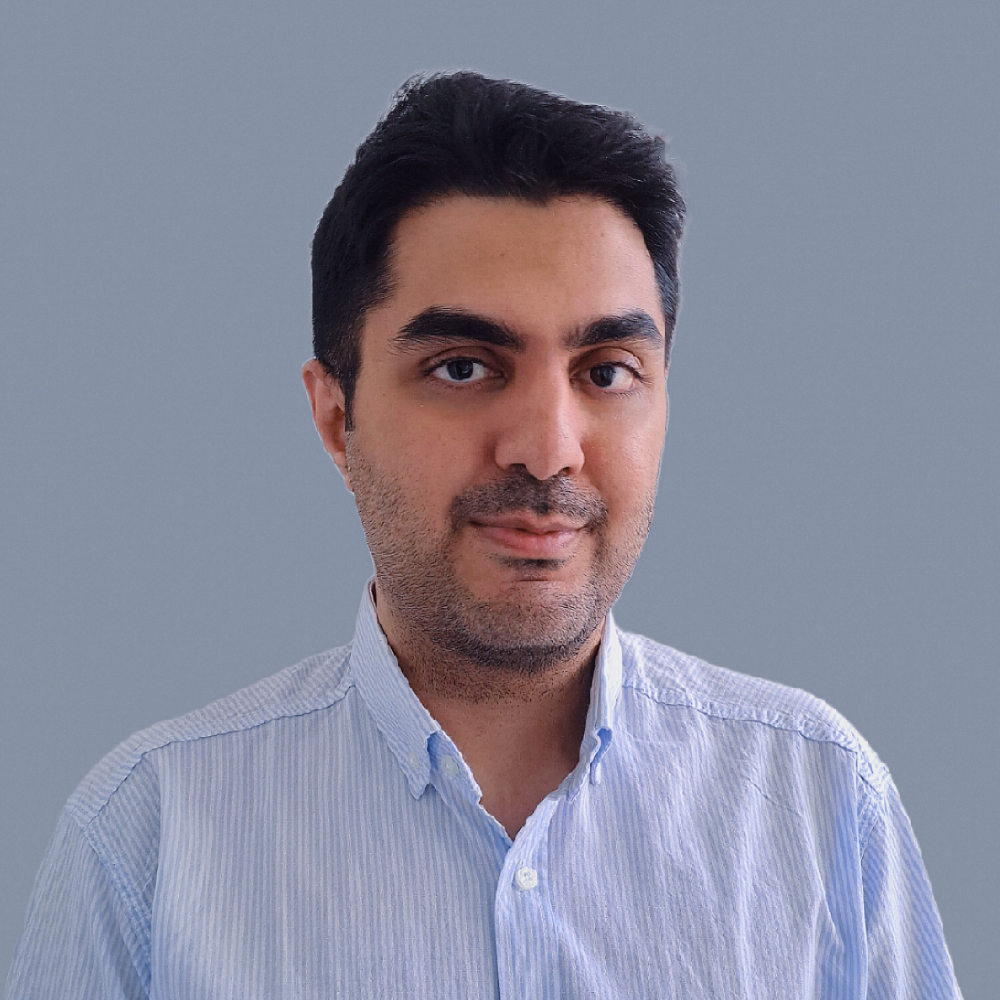

<html>
<head>

</head>
<body>

</body>
</html>

PhD Candidate | Industrial Engineer | Operations Research Scientist | Sustainable-Resilient Systems & Supply Chain Researcher | Award-Winning Thesis Author | Creator of FelooPy

I am a Ph.D. candidate in Industrial Engineering at the University of Tehran, specializing in developing sustainable and resilient strategies, tactics, and operations for manufacturing and service companies in the Industry 4.0 and 5.0 eras. I focus on finding economically efficient, environmentally friendly, and socially responsible solutions with real-world implications, which make systems, industries, and supply chains sustainable and resilient.

My expertise lies in developing optimization, data science, and machine learning models to solve challenging business problems. By combining operations research and machine learning, I contribute to the fields of operations research and management science.

I am eager to collaborate with industry leaders and fellow researchers to drive innovation and progress for systems, industries, and supply chains with sustainability and resiliency goals. I believe different problems require different ways of explaining or representing reality for a specific system, industry, or supply chain to obtain feasible, logical, and optimal solutions. I believe in algorithmizing, modeling, and solving problems in ways that are scalable, stable in computation time, and accurate. I am optimistic about the future of sustainable and resilient industries and supply chains and am committed to contributing to this vision.

Some highlights of my achievements include the following:

- Experienced 4+ years of developing mathematical models that have real-world impacts
- Published papers in international journals and conferences such as JRESS, EAAI, CAIE, JRCS, and JMTM.
- Reviewed papers for prestigious journals, including ESWA, TRE, ASOC, ORP, CAOR, SCA, IJPR, SMCA, and JCDE.
- Received the Best Theoretical Thesis Award from the Iranian Institute of Industrial Engineering in 2020.
- Gained valuable real-world experience through involvement in industrial and business projects, including Supplier Relationship Management (Hamrah -e Avval), Visual Management (MAPNA TUGA), and Business and Big Data Analytics (SAPCO ISACO).
- Developed an integrated optimization environment in Python called FelooPy which supports exact and heuristic optimization, constraint programming, convex optimization, multi-objective optimization, and multi-criteria decision-making with the most straightforward optimization programming language possible, which uses around 400 algorithms.
- Experienced in working with Cplex, Gurobi, Xpress, Local Solver, GAMS, Pyomo, PuLP, Ortools, scikit-learn, PyTorch, and TensorFlow, typical for operations research and machine learning.

Email: k.tafakkori [at] ut.ac.ir
LinkedIn: [linkedin.com/in/keivan-tafakkori](https://www.linkedin.com/in/keivan-tafakkori/)
