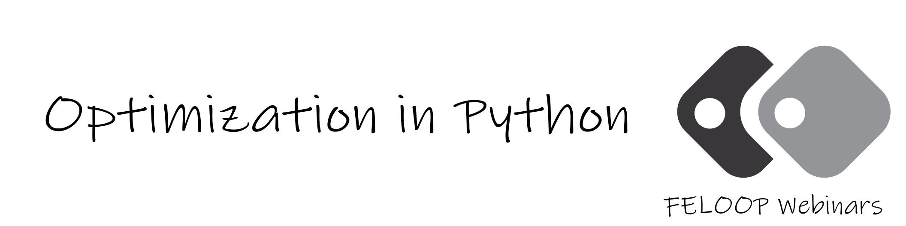

  

    <a href="https://forms.gle/CZhnmJns15gHkD1f8">
      
      <h3>Donation-based or Free (June 30, 2023)</h3>
      
Expert-based vs. Machine-based Planning: In this webinar, we will explore the role of machine learning and optimization, their similarities and differences, discuss emerging areas in operations research (OR), and review interfaces and solvers for optimization in Python. We will also share success stories of firms applying OR.

    </a>
  

  

  

    <a href="https://ktafakkori.github.io/">
      
      <h3>Free (March 18, 2023)</h3>
      
Optimization in Python: Maximum Capacity Reached! See you in the next webinars.

    </a>
  

