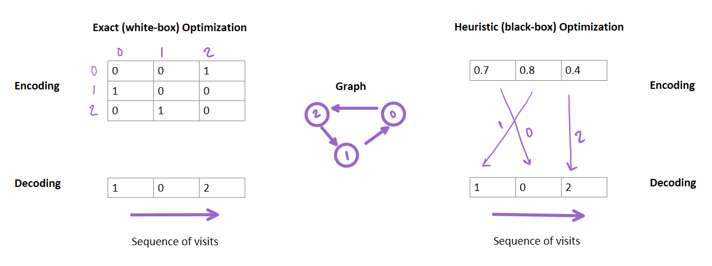

For some reason, a meta-heuristic algorithm is not working properly for a problem, or it doesn't seem easy to apply! It abruptly generates impermissible solutions!

In this short article, I offer a piece of advice on applying a meta-heuristic (heuristic optimization) algorithm for an optimization problem.

Some simple optimization problems can directly be coded in a meta-heuristic algorithm. Those include unconstrained ones with some upper and lower bounds on decision variables. These types of problems are primarily seen in the machine learning field.

But, many constraints are usually considered when an optimization expert develops a model for a real-world phenomenon such as a supply chain network. These types of models can not be directly encoded or decoded with simple random vectors.

For instance, consider a traveling salesman problem. In the mathematical formulation of this optimization problem, many binary variables represent moves from one node to the other. Can we consider these binary variables directly as a variable (data structure) in a meta-heuristic algorithm? The answer is no!

Why? Because random variations of these binary variables through iterations can lead to some infeasible or illogical solutions! For instance, if we code a random vector like `[1.2,1.5,2.4,3.5,5.6]` to show the sequence of visits for five cities (considering a range of random values in the interval `[1,6]`), then decode it by a rounding method, it can lead to `[1, 1, 2, 3, 5]` meaning that city #4 is not visited at all. Meanwhile, city #1 is being visited twice!

So what to do? The most important thing is to look for constraints with a positive right-hand side (not zeros and ones) and types of data to produce.

For instance, are we looking for a sequence? (e.g., in scheduling or routing), are we willing to find a positive value? (e.g., price), are we interested in answering by yes and no? (e.g., finding establishment locations for facilities or items to put in a knapsack), or are we looking for some integer numbers (e.g., the number of robots)?

The answer to the above questions leads to different solution encoding and decoding (representation) schemes. For instance, if we are looking for a sequence, the common method is using random key representation. In this method, we generate a random vector like this: `[0.95,0.35,0.46,0.57,0.34]` (considering a range of random values in the interval `[0,1]`), then find the position of the numbers by the smallest to the largest sorting scheme. The position of the smallest number is 5, then 5 is the first city to visit! Then, the next would be 2, and 2 would be the next city to visit, and so on. The encoded solution is decoded to `[5,2,3,4,1]`. Look how we can avoid generating illegal solutions! Variating the encoded values by variation operators can lead to another vector such as `[0.45,0.64,0.36,0.17,0.84]`, eliminating the need for extra repairing or penalty methods, and the solution still remains feasible and logical.

In some cases, such as a knapsack problem, we must select some items while meeting the knapsack's capacity. Selecting among 5 items can be encoded by a simple vector like `[0.3,0.45,0.7,0.6,0.4]`. Then rounding to the closest integer would result in a decoded vector `[0,0,1,1,0]`, meaning that only items 3 and 4 go into the knapsack! But what if their weights (in total) are larger than the knapsack's capacity? Should we consider penalties when the weight of items becomes larger than the capacity? It is an easy way to avoid infeasible solutions. But one can also apply other heuristics (e.g., first-fit or best-fit) to avoid such penalization methods.

In summary, to apply a meta-heuristic, you should check if the optimization problem is REALLY constrained or not. Can we still generate feasible values without considering constraints? (in some cases, it can happen!). If constraints can not be easily neglected, which of the above questions apply to the decisions? Can we define proper data structures to undergo variation operators of a meta-heuristic algorithm?

Overall, one should look for the decisions to be made regarding constraints when applying a meta-heuristic algorithm, then look for representation methods, repairing operators, heuristic operators, special algorithm dependent operators, CORRECT penalty functions, etc., to fix any illogical or infeasible solution.

The figure below can help you to understand the differences between exact and heuristic optimization methods in coding a TSP problem:

