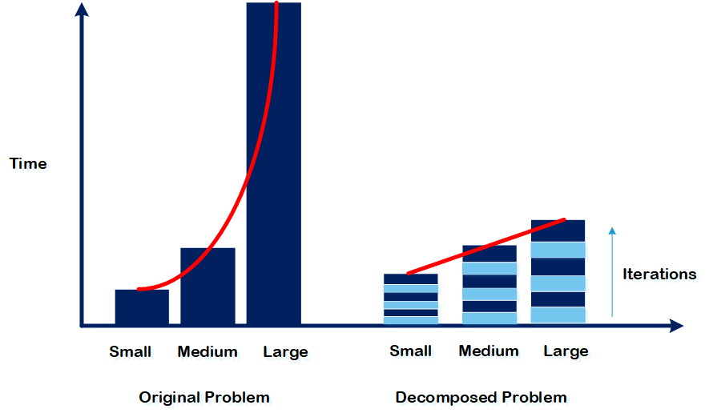
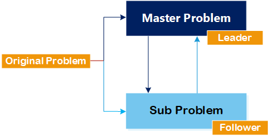

_Most of the problems in our world are in the form of an MILP._

An optimization expert may look for locating facilities by choosing among multiple candidate sites. Then, try to determine the amount of annual production to meet the yearly demand. Such decision-making is at a strategic level, which usually includes an n-year time horizon of impacts. For instance, if we locate facilities in areas with higher traffic congestion, for the next n years, the firm would be responsible for paying penalties for unsustainable transportation or noise pollution due to production processes. Accordingly, it could bring huge costs by making a negligibly different solution.

On the other hand, some decisions are tactical, which usually includes master planning flows in a supply chain to meet seasonal or monthly demands. What if such decisions were made wrong? The firm may lose its competitiveness or social responsibility by not meeting demand due to the shortages. Shortages could be due to a lack of proper inventory planning or, in the worst case, disruptive events. So, if we do not consider multiple scenarios, again, huge losses would be imposed.

At the operational level, a firm is usually looking to optimize its operations such as routing, scheduling, manufacturing, etc. At this level, the impact of wrong decisions may be negligible, but if we look at the scale and frequency of the operations, we can not ignore possible cumulative losses in the long run. For example, even controlling a system in real-time to reduce the speed of an autonomous vehicle while a human is seen or answering a pool of orders for last-mile delivery can be vital. An intensely robust and reliable system should make these decisions as the losses are usually vast and irreversible! Therefore, exact solutions to logically modeled optimization problems do matter.

Decomposition-based techniques can alleviate SOME concerns mentioned like: "since the problem is NP-hard, the solution time is high, and we can not apply exact methods." These techniques owe to increase the applicability of exact optimization methods but also can be used in heuristic-based methods. Empowered by quantum and cloud computing, this alleviation process can go further. For instance, consider a problem where a brute force method to search all possible "yes" or "no" is $2^n$, where n is the number of binary variables. If this problem contains 6 variables, we must search among 64 solutions. If the computer can search for a solution in 1 second, the total CPU time would be 64s. Now consider decomposing this problem to two with 3 variables. Now each of these problems would take $2^3$ (8) seconds to solve. 8+8=16s still is far away from 64s, which is required for the original problem to be solved. That's the central intuition for legendary decomposition-based methods.

One of these methods is the Benders Decomposition, proposed by Jacque F. Benders in 1962. In this method, a problem is decomposed into a master problem (leader) (MP) and a subproblem (follower) (SP). MP gives the subproblem (or correctly the dual version of the subproblem) some integer solutions, by which the SP finds some dual values and helps the MP to revise its solutions. Its basic version is applicable to large scale LPs and MILPs, but there are more advanced versions which can be applied to NLPs, MINLPs and even pure IPs.

The figure below shows how a problem's upper and lower bounds obtained by MP and SP get close to each other after several iterations of this algorithm.

If you are interested in fully understanding how the basic version of the benders decomposition works, you may purchase our tutorial! Visit this page: [Tutorials](/tutorial/). This will empower you to build scalable models.
